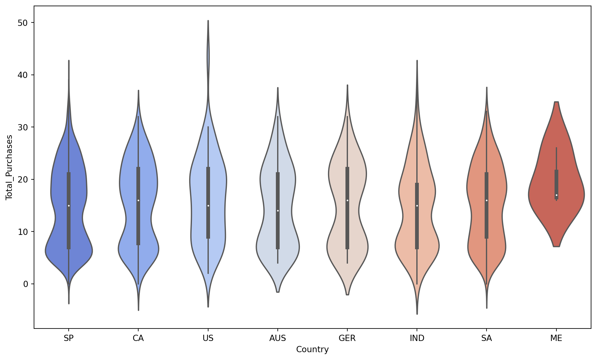

# Projeto: Análise de Clientes para Shopping Center

### ➡️ Análise Completa e Detalhada no Meu Portfólio:
[Acesse a página completa do projeto aqui](https://ferreiragabrielw.github.io/portfolio-gabriel/projetos/DataAnalytics/1CustumerShoppingCenter/1AnaliseDadosShoppingCenter.html)

---

## Sobre o Projeto

Este projeto é uma **análise de dados de ponta a ponta (E2E)** focada no estudo das características e padrões de compra de clientes de um shopping center real (Singapura). Utilizando Python para tratamento e análise de dados, e Quarto para relatórios, o objetivo é transformar dados brutos em insights acionáveis para otimizar operações, personalizar ofertas e maximizar o valor do cliente.

## Tecnologias e Processo

* **Ferramentas**: Python (Pandas, Matplotlib, Seaborn), Quarto (para relatórios), Jupyter Notebook/VS Code.
* **Pipeline de Análise**:
    * **Coleta e Pré-processamento**: Carregamento de dados (`.csv`), análise exploratória, tratamento de valores ausentes, correção de tipos de dados e remoção de outliers.
    * **Engenharia de Atributos**: Criação de novas features como Idade do Cliente no Cadastro, Gasto Total, Total de Compras e Presença de Crianças/Adolescentes.
    * **Análise Exploratória e Visualizações**: Geração de gráficos (violin plots, distplots, regplots, countplots, pie charts) para entender demografia (idade, escolaridade, estado civil), padrões de renda e gasto, comportamento de compra por país, e sazonalidade de cadastros.
* **Insights Chave**: Identificação de público-alvo (35-45 anos, alta escolaridade, casados), correlação entre renda/escolaridade/gastos, predominância de clientes locais (Singapura) com destaque para Arábia Saudita/Canadá, e padrões específicos de compra por país.

## Conteúdo do Repositório

* `data/`: Contém o dataset (`dataset_shoppingcenter.csv`) utilizado na análise.
* `notebooks/`: Inclui o **Jupyter Notebook (`.ipynb`)** com o código e as etapas da análise.
* `quarto/`: Inclui o arquivo-fonte `.qmd` da análise e sua versão `html` renderizada.
* `README.md`: Este documento.
* `LICENSE`: Licença do projeto (MIT License).

## Como Visualizar a Análise Completa

* **Online (HTML)**: Faça o download do arquivo `1AnaliseDadosShoppingCenter.html` da pasta `quarto/` e abra-o em seu navegador.
* **Jupyter Notebook**: Visualize o Jupyter Notebook diretamente no GitHub ou faça o download do arquivo `.ipynb` da pasta `notebooks/` e abra-o em seu ambiente Jupyter.
* **Localmente (Quarto)**:
    1.  Faça o download do arquivo `1AnaliseDadosShoppingCenter.qmd` da pasta `quarto/`.
    2.  Certifique-se de ter o Quarto e Python com as bibliotecas necessárias instalados.
    3.  Abra o `.qmd` em um editor compatível (VS Code com extensão Quarto) e compile-o.

---

### Licença

Este projeto está licenciado sob a [MIT License](LICENSE).